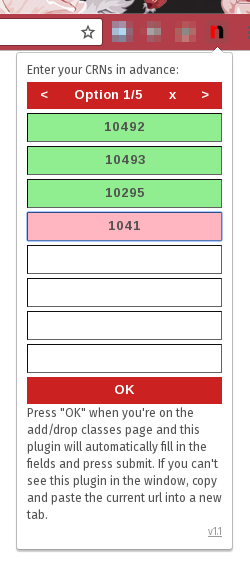

neu-courseregisterer
====================

A small extension that performs the task of pasting your CRNs into the Add/Drop
Classes form and clicking Submit for you. This can save a handful of seconds
that may make or break whether or not you can register for those high-demand
classes.

updates
-------

*   1.1: Support for backup CRN combinations; UI improvements; documentation
*   1.0: Initial release

manual installation
-------------------

1.  Download a stable release from the project [releases](https://github.com/ercas/neu-courseregisterer/releases)
    page, or clone the repository for the latest updates.
2.  Unpack the extension.
3.  Go to [chrome://extensions](chrome://extensions/) and enable Developer mode.
4.  Click "Load unpacked extension..." and navigate to where you unpacked the
    extension. You should select the directory containing "popup.html" in it.
5.  Check to see if the extension works. It should have created a lowercase "n"
    in your toolbar.

usage
-----

It may be a good idea to try this plugin on the term you're already registered
for to make sure it works; the CRNs should show up as Invalid at the bottom of
the page.

1.  **Before it's time to register,** enter your CRNs into the fields. Valid
    CRNs will have a green background; invalid CRNs will be red and will be
    ignored. You can enter multiple different combinations of CRNs by using the
    back/forward buttons or clear the current combination with the x button.
2.  Navigate to the Course Registration page via myNEU.
3.  Clicking on Course Registration should have opened a new window for you with
    no toolbar. We need the toolbar, so copy and paste the URL of this new
    window back into the old window. You can close the new window afterwards.
4.  Navigate to Add/Drop Classes.
5.  When it's time to register, click the Submit button to get to the Add/Drop
    classes page.
6.  Click the plugin again and click "OK" to register your CRNs.
